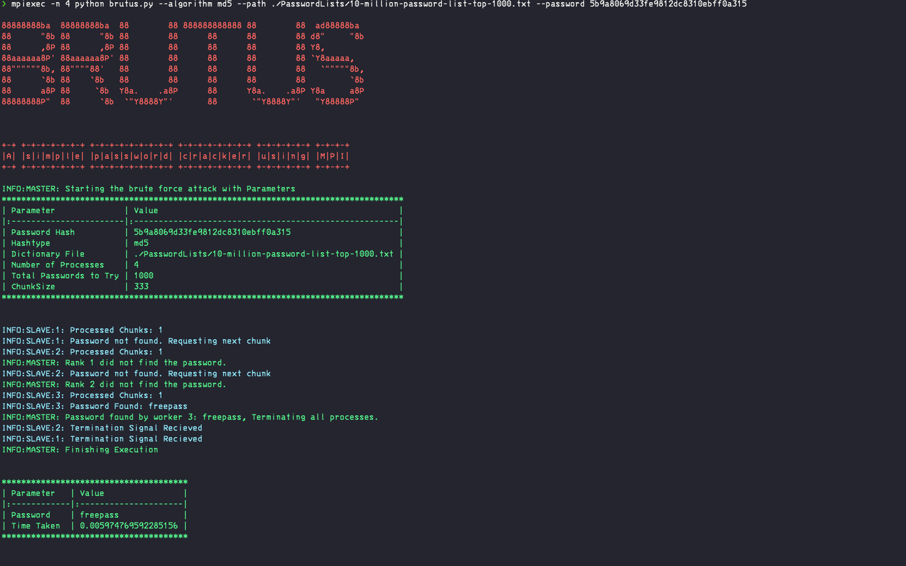

# Brutus

A simple dictionary based password cracker.

[](https://www.python.org/)
[](https://go.dev/)




## MPI-Installation

### Mac-OS

```{bash}
brew install openmpi pkg-config
mpicc --showme:libdirs
```

Adding the path:

```
export PKG_CONFIG_PATH="/opt/homebrew/lib/pkgconfig:$PKG_CONFIG_PATH"
export LIBRARY_PATH="/opt/homebrew/Cellar/open-mpi/5.0.3_1/lib:$LIBRARY_PATH"
export LD_LIBRARY_PATH="/opt/homebrew/Cellar/open-mpi/5.0.3_1/lib:$LD_LIBRARY_PATH"
```

## Building Go APP

```
    go build -tags mpi -o brutus brutus.go
    mpirun -np 4 ./brutus
```

## TODO

- [x] Basic Implementation using Python or Go
  - [x] Chunking Dictionary File
  - [x] Distributing Chunks Equally
    - File is not being read by master process. It only distributes the Line Numbers.
  - [x] Searching for Password
- [x] Stopping Search when password is found by a worker
  - GO Implementation is pending. Already working in Python
- [ ] Work Stealing
  - If a slave has finished the work, request more work from Master process

## Notes
The Go Mpi module doesn't support non-blocking recieving or sending.

## Authors and acknowledgment

Show your appreciation to those who have contributed to the project.

## License

For open source projects, say how it is licensed.

## Project status

If you have run out of energy or time for your project, put a note at the top of the README saying that development has slowed down or stopped completely. Someone may choose to fork your project or volunteer to step in as a maintainer or owner, allowing your project to keep going. You can also make an explicit request for maintainers.
