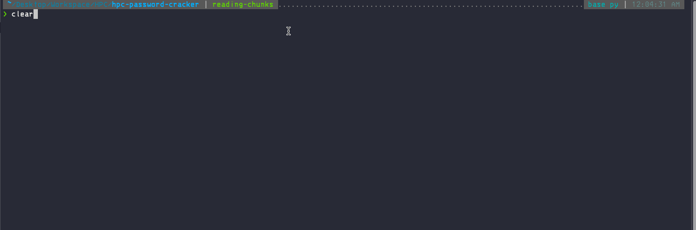

# Brutus

A simple dictionary based password cracker.




## MPI-Installation

### Mac-OS

```{bash}
brew install openmpi pkg-config
mpicc --showme:libdirs
```

Adding the path:

```
export PKG_CONFIG_PATH="/opt/homebrew/lib/pkgconfig:$PKG_CONFIG_PATH"
export LIBRARY_PATH="/opt/homebrew/Cellar/open-mpi/5.0.3_1/lib:$LIBRARY_PATH"
export LD_LIBRARY_PATH="/opt/homebrew/Cellar/open-mpi/5.0.3_1/lib:$LD_LIBRARY_PATH"
```

## Running Python

### Workflow

#### Profile User
  - Use the profile_user.py script to generate the password stems for the user. Change the profile variable with the desired profile of the user.  
    - python src/profile_user.py
  - Optionally generate extra passwords using CuPP
    - python src/cupp/cupp.py -w ./PasswordLists/password_stems.txt

#### Cracking the Hash
```(python)
mpiexec -n 4 python src/brutus.py --algorithm md5 --path ./PasswordLists/xato-net-10-million-passwords.txt --password 54379dd2055658dd75c866f21435cff2 --chunksize 50000
```
Using a hostfile
```(python)
mpiexec -n 12 --hostfile pcs.txt python3 brutus.py --algorithm md5 --path ./PasswordLists/10-million-password-list-top-1000.txt --password 5b9a8069d33fe9812dc8310ebff0a315 --chunksize 20000
```

## TODO

- [x] Basic Implementation using Python or Go
  - [x] Chunking Dictionary File
  - [x] Distributing Chunks Equally
    - File is not being read by master process. It only distributes the Line Numbers.
  - [x] Searching for Password
- [x] Stopping Search when password is found by a worker
  - GO Implementation is pending. Already working in Python
- [x] Dynamic Work Distribution
  - If a slave has finished the work, request more work from Master process

## Notes
The Go Mpi module doesn't support non-blocking recieving or sending hence the implementation was switched to Python.
